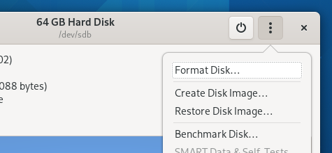
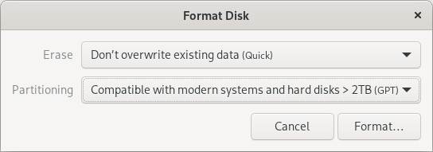
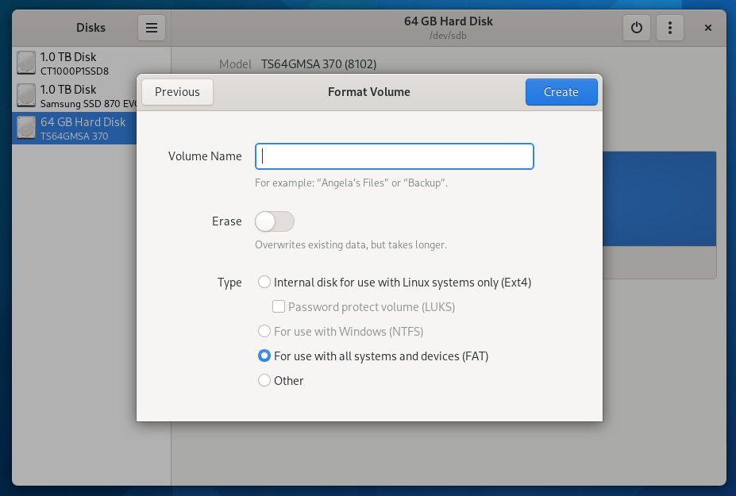
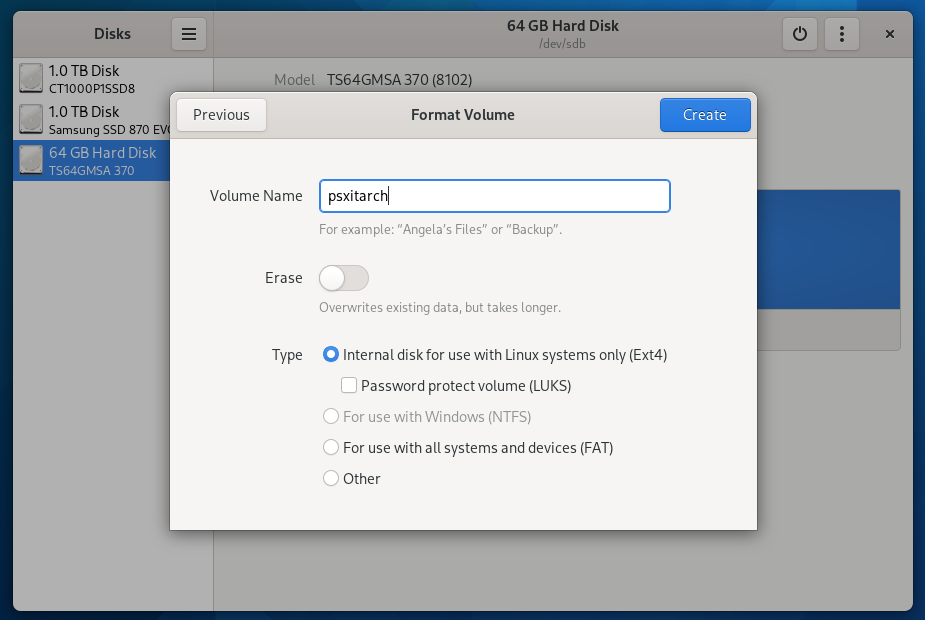

# 2.a. Partitioning your Filesystem (Gnome Disks)

The PSXITARCH initramfs attempts to boot into a rootfs that has the label `psxitarch`

These steps will partition and label your disk with the Gnome disk utility.

## 2.a.1. Format your disks

Format (aka initialise) your disks

Choose GPT, especially if you want to use a disk larger than 2tb in size.

> (Writers note: I learned the hard way with a 4tb hard drive that MBR is not the correct option.)

## 2.a.2. Partition your disks

### FAT

Create a FAT partition (512MB should do, but feel generous if you feel like it). 
It should be large enough to store the `initramfs.cpio.gz` and `bzImage` files from earlier.

> (Writers note: Yes, we did just create a FAT16 partition instead of a FAT32 partition, but I couldn't find the option within Gnome Disks. Create a PR with instructions on how to do FAT32 if you figure it out.)

### EXT4

Create an EXT4 partition directly after the FAT partition, taking up the remainder of the space.

> (Writers note: Other formats may or may not work, depending on the kernel support; Last time I tried BTRFS, it didn't work.)
