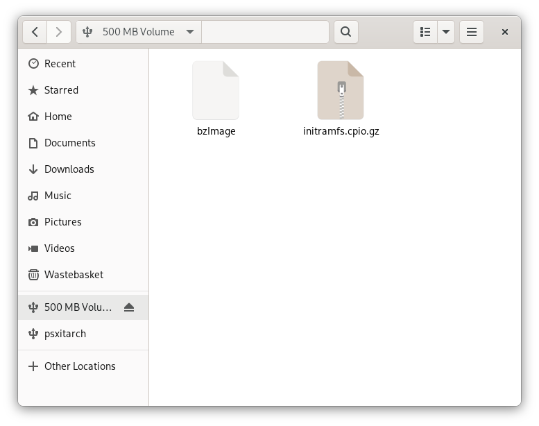

# 3.a. Placing files / Mounting Partitions (Gnome Files)

(Writers note: Did we really need an entirely new page for this?)

## 3.a.1. FAT

Place the `bzImage` and `initramfs.cpio.gz` into the FAT partition. (the one that's 512MB)

## 3.a.2. EXT4

Click the `psxitarch` drive to mount it.
